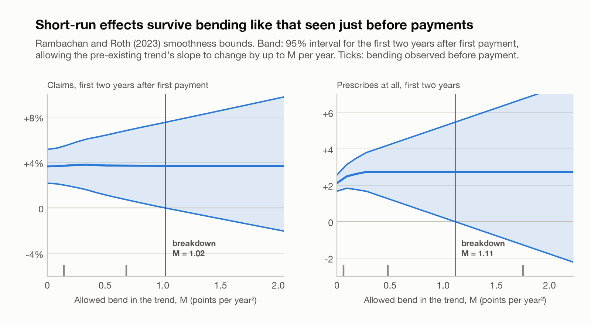
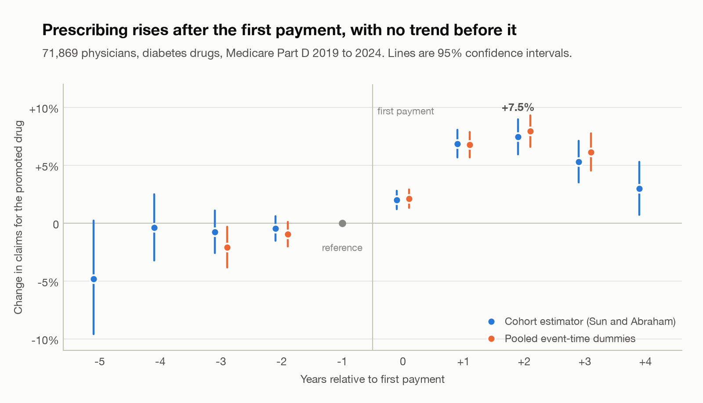
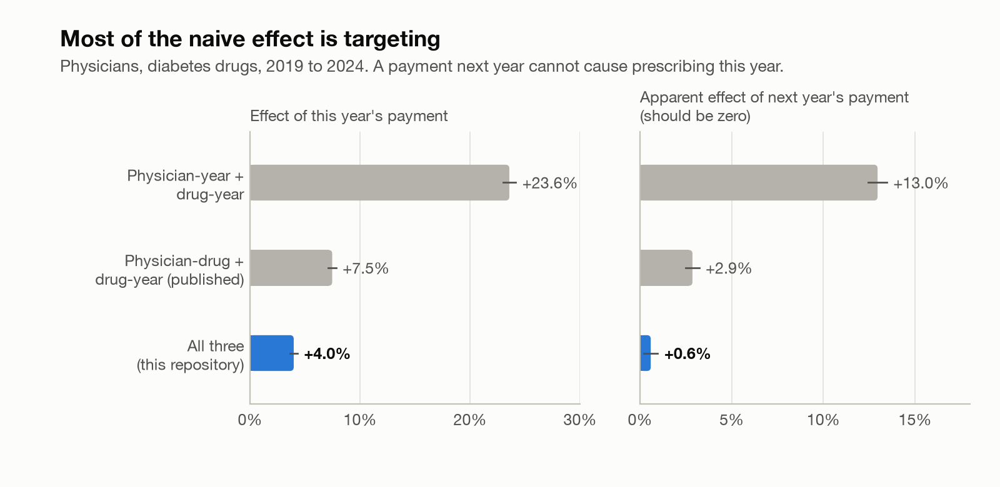

# rx-incrementality

[](https://github.com/ramanaprabhusana/rx-incrementality/actions/workflows/tests.yml)


**Do pharmaceutical payments to physicians still move prescribing in the GLP-1
era, and how much of the apparent effect is really targeting? Estimated on
public CMS data for 2019 to 2024, with every design first validated against
simulated ground truth.**

## Results

Among 71,869 physicians already prescribing a diabetes drug, a payment
relationship about it is associated with **+4.0%** more Medicare claims for that
drug (95% CI 3.6 to 4.3%). Controlling for anticipatory targeting gives
**+2.5%**, so the honest range is about 2.5 to 4.0%. The effect builds from
+2.0% in the year of first payment to +7.5% two years later, with no trend
beforehand, and holds (+4.1%) on pairs whose observation cannot depend on
treatment.

**Whether physicians adopt a drug at all is a different story.** Adoption was
already rising before the first payment: representatives target physicians who
are starting to prescribe. That margin fails its pre-trend test, so its +2.5
point estimate is not credible as a plain causal estimate.

**How much could the trends bend before these results disappear?** Using
Rambachan and Roth (2023) bounds, the effects in the first two years after
payment survive the pre-existing trend's slope changing by about 1 point per
year, more than the trend bent in the two years before payments started. Effects
three or more years out do not survive any meaningful bending, and adoption does
not survive the largest bending observed, four years before onset.

<picture>
  <source media="(prefers-color-scheme: dark)" srcset="docs/figures/sensitivity-dark.png">
  
</picture>

<picture>
  <source media="(prefers-color-scheme: dark)" srcset="docs/figures/event-study-dark.png">
  
</picture>

That is in line with Carey, Lieber and Miller's +2.2% to +5.2% for 2013 to 2015,
so **published effect sizes roughly hold into the GLP-1 era**: +4.7% for GLP-1
agents (+5.9% in 2022 to 2024 excluding Mounjaro), +3.7% for SGLT2 inhibitors, a
precise zero for the mature DPP-4 class. Specialties respond alike (3.3% to
5.2%), nurse practitioners and physician assistants like physicians (+3.7%), and
a $940 speaker fee barely more than a $17 lunch (+4.9% against +4.0%).

## Most of the apparent effect is targeting

<picture>
  <source media="(prefers-color-scheme: dark)" srcset="docs/figures/specification-dark.png">
  
</picture>

A payment next year cannot cause prescribing this year, so its apparent effect is
a falsification test. Without physician-by-drug effects the estimate is six times
too large, because representatives target physicians who already favour their
drug. On annual data the published design also fails the test, and adding
physician-by-year effects cuts the estimate by a further 45%. That does not
contradict the published monthly analysis, whose pre-trends are flat; it means
annual public data need all three sets of fixed effects.

Full results, robustness and caveats: **[docs/results.md](docs/results.md)**.

## Why this design: simulated ground truth first

Every design was run on simulated panels where the true effect is exactly 0.050,
under four targeting regimes, 30 replications each:

| How representatives choose physicians | 2-way | 3-way |
| --- | --- | --- |
| At random | 0.048, coverage 93% | 0.048, coverage 97% |
| Physicians whose prescribing is rising | 0.047, coverage 87% | 0.048, coverage 100% |
| **Physicians who already favour the drug** | **0.686, coverage 0%** | **0.046, coverage 97%** |
| Physicians whose use of that drug is rising | 0.091, coverage 37% | 0.097, coverage 0% |

The 3-way design survives the realistic forms of targeting and is three times
more precise. **The last row is a real limitation**: no design here survives
targeting on a physician's rising use of one specific drug. The event-study
pre-trend test is how to detect it. On the real data it passes for how much
physicians prescribe and fails for whether they adopt, which is exactly the case
it exists to catch.

The event study uses a cohort estimator (Sun and Abraham, 2021) rather than pooled
relative-time dummies, which can be contaminated when effects build over time.
On simulated data with growing, cohort-specific effects it recovers the true path
with less than half the pooled version's error, and the pooled version invents a
pre-period effect that is not there. On the real data the pooled version shows a
pre-period dip (t = -2.3) that the cohort estimator does not. Details:
[docs/findings.md](docs/findings.md), [docs/methodology.md](docs/methodology.md).

## What is new here, and what is not

**Not new.** Physician-by-drug fixed effects come from [Carey, Lieber and Miller
(2021)](https://doi.org/10.1016/j.jpubeco.2021.104402). [Agha and Zeltzer
(2022)](https://doi.org/10.1257/pol.20200044) estimate effects for
anticoagulants and show peer spillovers matter.

**What this adds.**

1. **The GLP-1 era.** Both studies end by 2016; this covers 2019 to 2024.
2. **On annual data, the published design needs physician-year effects**,
   shown with a falsification test rather than asserted.
3. **A bias benchmark**: each design measured against known truth under each
   targeting regime, with interval coverage.
4. **Fully public and reproducible**: no data use agreement, hashed inputs.

Full accounting: [docs/related-work.md](docs/related-work.md).

## Data

| Source | Grain | Scale |
| --- | --- | --- |
| Part D by Provider and Drug | prescriber-drug-year | 3,715,046 rows, 2019 to 2024 |
| Open Payments, general payments | payment record | 5,491,153 records matched |

Public, key-free, no protected health information. Three things the data force:

- **Brand families.** Part D splits a brand across pack sizes and devices
  (`Victoza 2-Pak`, `Victoza 3-Pak`); Open Payments reports the brand (`VICTOZA`).
  An exact-name join silently lost 1.58M Victoza claims in 2019. The crosswalk
  now matches 28 of 29 families on both sides.
- **Coverage.** Open Payments only began covering nurse practitioners and
  physician assistants in 2021, so their earlier payments are unknown rather than
  zero. Physicians are the primary population; others are estimated on 2021 to
  2024.
- **Suppression.** Part D omits cells under 11 claims, so effects are estimated on
  two margins: whether a physician prescribes a drug at all, and how much.

Sources, row counts and SHA-256 hashes of every input file:
[results/provenance.json](results/provenance.json). Details:
[docs/data-sources.md](docs/data-sources.md).

## Reproduce

```bash
make install      # pip install -e ".[dev]"
make test         # 164 tests, no network needed
make demo         # simulation tables
make data         # download CMS extracts, about 1.5 GB and 45 minutes
make estimate     # results/estimates.json, about 8 minutes
make sensitivity  # results/sensitivity.json, Rambachan and Roth bounds, about 1 minute
make figures      # docs/figures/
make provenance   # results/provenance.json
```

```python
from rxinc import simulate_drug_panel, triple_diff
from rxinc.estimators import cohort_event_study
from rxinc.diagnostics import pretrend_test

panel = simulate_drug_panel()
print(triple_diff(panel, absorb=("physician_year", "drug_year", "physician_drug")))
print(pretrend_test(cohort_event_study(panel)))
```

## Layout

```
src/rxinc/
  simulate.py     single-outcome panel DGP
  drugpanel.py    prescriber-drug-year DGP: four targeting regimes, dynamic and cohort effects
  estimators.py   OLS, two-way FE, DiD, ITS, k-way triple difference, pooled and cohort event studies
  diagnostics.py  pre-trend test, placebo, balance, trend adjustment, Monte Carlo
  sensitivity.py  Rambachan and Roth smoothness bounds and breakdown values
  crosswalk.py    brand families across Part D and Open Payments
  drugdata.py     CMS extracts to the estimation panel, coverage-aware
  datasets.py     CMS clients, robust to catalog layout changes
scripts/          acquisition, estimation, figures, provenance
results/          estimates.json, sensitivity.json, provenance.json
docs/             results, problem, approach, related work, methods, data, simulation
```

## Limitations

- **Adoption is only partly robust.** Whether physicians start prescribing a
  drug fails its pre-trend test; reps target early adopters. Its short-run jump
  survives some trend bending, not the largest observed.
- **Long-run effects are fragile.** Three or more years after payment, estimates
  rest on straight-line extrapolation of pre-trends.
- **Not proof of causation for claims either.** Pre-trends pass and the
  falsification test nearly passes, but a small residual next-year coefficient
  (+0.006, SE 0.002) shows some anticipatory targeting remains.
- **Medicare only**, which matters for GLP-1 agents given commercial and cash-pay
  use.
- **Suppression** below 11 claims; the intensive margin is conditional on it.
- **Annual timing** cannot order payment and prescribing within a year.
- **Peer effects** are proxied by city, far cruder than shared-patient networks;
  the null result there says little.

## Sources

- [Carey, Lieber and Miller (2021), Journal of Public Economics 197](https://doi.org/10.1016/j.jpubeco.2021.104402) ([NBER WP 26751](https://www.nber.org/papers/w26751))
- [Agha and Zeltzer (2022), American Economic Journal: Economic Policy 14(2)](https://doi.org/10.1257/pol.20200044)
- [Sun and Abraham (2021), Journal of Econometrics 225(2)](https://doi.org/10.1016/j.jeconom.2020.09.006)
- [Rambachan and Roth (2023), Review of Economic Studies 90(5)](https://doi.org/10.1093/restud/rdad018)
- [Annals of Internal Medicine systematic review (2021)](https://doi.org/10.7326/M20-5665)
- [Open Payments, CMS](https://www.cms.gov/priorities/key-initiatives/open-payments)
- [Medicare Part D Prescribers by Provider and Drug, CMS](https://data.cms.gov/provider-summary-by-type-of-service/medicare-part-d-prescribers/medicare-part-d-prescribers-by-provider-and-drug)

## License

MIT
